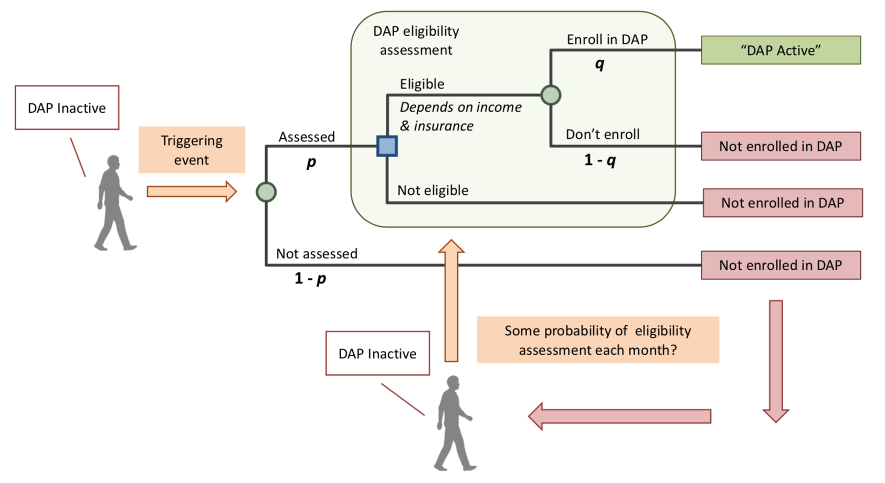

# DAP enrollment

**Eligibility criteria**: 
<table>
<tr><th bgcolor="#737CA1"><strong>Program</strong></th><th bgcolor="#737CA1"><strong>Dignosis</strong></th><th bgcolor="#737CA1"><strong>Income</strong></th><th bgcolor="#737CA1"><strong>Insurance</strong></th><th bgcolor="#737CA1"><strong>Prescription</strong></th><th bgcolor="#737CA1"><strong>Risk factors</strong></th></tr>

<tr><td><b>ADAP</b></td><td>Proof of HIV+</td><td>138%-400% of FPL</td><td>1. Uninsured: find insurance for them 2. Insured: exclude medicaid</td><td>Doesn't seem required</td><td>NA</td></tr>

<tr><td><b>PDAP</b></td><td>Tested HIV- within 14 days</td><td>>138% FPL for family of 1</td><td>Can be uninsured or insured but <i><b>cannot</i></b> receive medicaid</td><td>The providers are required to certify the prescription</td><td>1. STI+ in the last 12 months. 2. Unprotected sex outside of mutually monogamous relationship. 3. HIV+ partner is on ART but not virally suppressed.</td></tr>
</table>

* Questions to DOH: 
    - Do ADAP enrollees have to initiate ART to be eligible to ADAP? 
    - Do PrEP-DAP enrollees have to initiate PrEP to be eligible to PrEP-DAP? 
    - Are the risk factors considered as elibility criteria in PrEP-DAP application? 

<a href="ModuleSum.md#DAPenroll">Back</a>