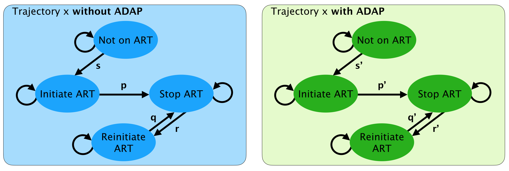
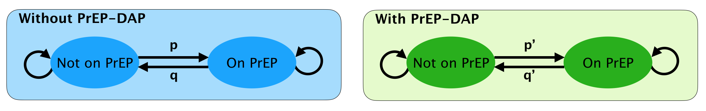

# DAP status influences on outcomes

Individuals have a DAP attribute, assigned to be "DAP active" for upon successful DAP enrollment

###ADAP

* ADAP active have higher probability of (re)initiating ART.
* ADAP active have lower probability of discontinuing ART.

**Parameter table (parameter, data source, stratification)**

###PrEP-DAP

* PrEP-DAP active are more likely to initiate PrEP
* Behaviors that may be influenced by PrEP-DAP enrollment:
    - Discontinuation (might only dependent on the risk factor but not on income/insurance).
    - Individuals who are on PrEP are required to test HIV/STI more frequently.

**Parameter table (parameter, data source, stratification)**

**Question:** 
* Question: would PrEP-DAP clients behave differently than individuals who are on PrEP but not enrolled in PrEP-DAP? (e.g., HIV/STI testing behaviors)

<a href="CostingModelSum.md">Back</a>
