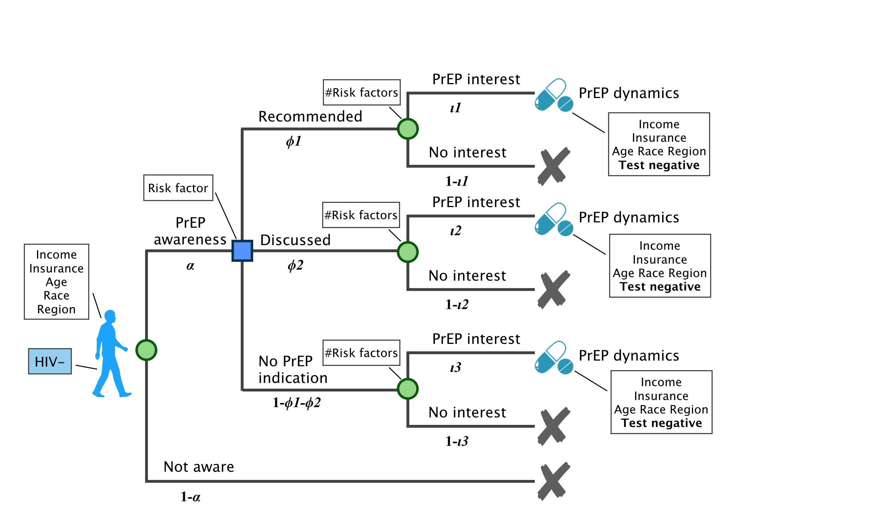
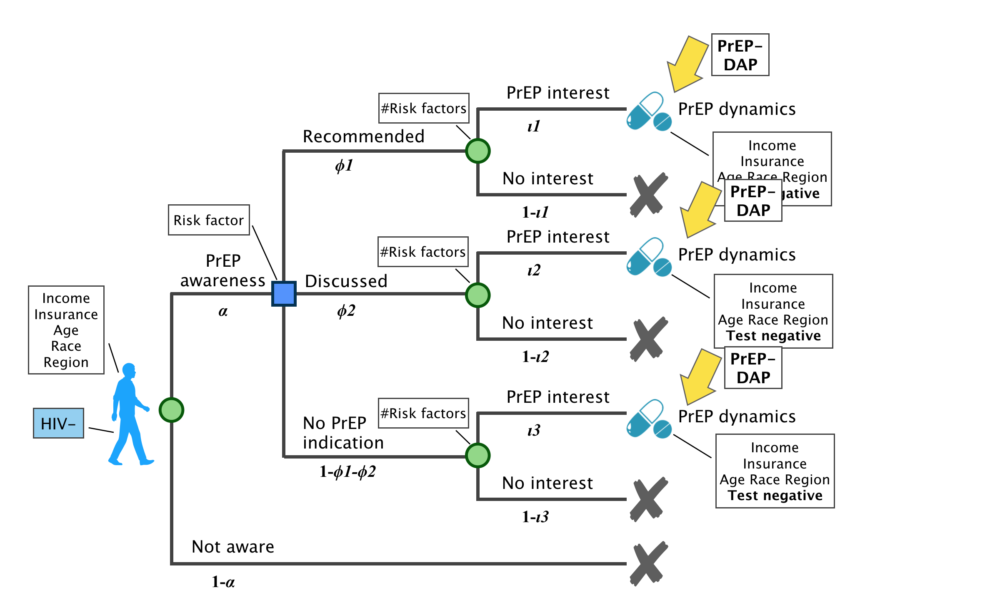

# HIV-negative
##
PrEP continuum

* Recommended indicates the PrEP recommendation on the WA guideline. 
    - Diagnosed with rectal gonorrhea or syphilis in the past 12 months.
    - Ongoing sexual relationships with HIV+ partners who are not virally suppressed or not on ART
* Discussed indicates that providers should discuss use of PrEP with individuals who meet: 
    - Have unprotected sex outside of mutually monogamous partnerships with a man who is HIV-. 
    - Diagnosed with gonorrhea or chlamydia in the past 12 months. 
    - Ongoing sexual partnerships with HIV+ who are virally suppressed. 

**Parameters**
<table>
<tr>
    <th bgcolor="#737CA1"><strong>Label</strong></th>
    <th bgcolor="#737CA1"><strong>Parameter</strong></th>
    <th bgcolor="#737CA1"><strong>Data Source</strong></th>
    <th bgcolor="#737CA1"><strong>Stratification</strong></th>
    <th bgcolor="#737CA1"><strong>Question</strong></th>
</tr>

<tr>
    <td><i>&alpha;</i></td>
    <td> XX </td>
    <td> XX </td>
    <td> XX </td>
    <td> XX </td>
</tr>

<tr><td colspan=5 bgcolor="#E5E4E2"><i><b>PrEP indication</i></b></td></tr>
<tr>
    <td><i>&phi;1</i></td>
    <td> XX </td>
    <td> XX </td>
    <td> XX </td>
    <td> XX </td>
</tr>

<tr>
    <td><i>&phi;2</i></td>
    <td> XX </td>
    <td> XX </td>
    <td> XX </td>
    <td> XX </td>
</tr>
<tr><td colspan=5 bgcolor="#E5E4E2"><i><b>PrEP interest</i></b></td></tr>
<tr>
    <td><i>&iota;1</i></td>
    <td> XX </td>
    <td> XX </td>
    <td> XX </td>
    <td> XX </td>
</tr>
<tr>
    <td><i>&iota;2</i></td>
    <td> XX </td>
    <td> XX </td>
    <td> XX </td>
    <td> XX </td>
</tr>
<tr>
    <td><i>&iota;3</i></td>
    <td> XX </td>
    <td> XX </td>
    <td> XX </td>
    <td> XX </td>
</tr>
</table>

##
PrEP-DAP and care continuum

**Criteria of enrollment**
- Income: no restriction
- Insurance: cannot receive medicaid
- HIV- test result requred within 14 days
- Prescription: providers are required to certify the prescription
- Risk factors: 
    + Test positive for STIs (gonorrhea, chlamydia, and syphilis) in the last 12 months
    + Unprotected sex outside of mutually monogamous relationship
    + HIV+ partners 

**Criteria of recertification**
- Frequency of recertification: every year
- Test: test HIV- in the past 90 months
- Proof of taking PrEP: NA

<a href="HIVnegative.md#PrEPcontinuum2">Next</a>

<a href="HIVnegative.md#PrEPcontinuum3">Next</a>

* Only the individuals who are aware of and interested in PrEP can be enrolled in PrEP-DAP
* PrEP-DAP modifies the probabilities in the PrEP dynamics. 

**Parameters**
<table>
<tr>
    <th bgcolor="#737CA1"><strong>Label</strong></th>
    <th bgcolor="#737CA1"><strong>Parameter</strong></th>
    <th bgcolor="#737CA1"><strong>Data Source</strong></th>
    <th bgcolor="#737CA1"><strong>Stratification</strong></th>
    <th bgcolor="#737CA1"><strong>Question</strong></th>
</tr>

<tr>
    <td><i>e1</i></td>
    <td> XX </td>
    <td> XX </td>
    <td> XX </td>
    <td> XX </td>
</tr>

<tr>
    <td><i>e2</i></td>
    <td> XX </td>
    <td> XX </td>
    <td> XX </td>
    <td> XX </td>
</tr>

<tr>
    <td><i>e3</i></td>
    <td> XX </td>
    <td> XX </td>
    <td> XX </td>
    <td> XX </td>
</tr>
</table>

##
PrEP and PrEP-DAP dynamics

* PrEP indication dynamics and PrEP-DAP dynamics should be considered at the same time. 

**Parameters**
<table>
<tr>
    <th bgcolor="#737CA1"><strong>Label</strong></th>
    <th bgcolor="#737CA1"><strong>Parameter</strong></th>
    <th bgcolor="#737CA1"><strong>Data Source</strong></th>
    <th bgcolor="#737CA1"><strong>Stratification</strong></th>
    <th bgcolor="#737CA1"><strong>Question</strong></th>
</tr>

<tr><td colspan=5 bgcolor="#E5E4E2"><i><b>PrEP indication dynamics</i></b></td></tr>
<tr>
    <td><i>&kappa;</i></td>
    <td> XX </td>
    <td> XX </td>
    <td> XX </td>
    <td> XX </td>
</tr>

<tr>
    <td><i>&pi;</i></td>
    <td> XX </td>
    <td> XX </td>
    <td> XX </td>
    <td> XX </td>
</tr>

<tr><td colspan=5 bgcolor="#E5E4E2"><i><b>PrEP-DAP dynamics</i></b></td></tr>

<tr>
    <td><i>&rho;1</i></td>
    <td> XX </td>
    <td> XX </td>
    <td> XX </td>
    <td> XX </td>
</tr>

<tr>
    <td><i>&rho;2</i></td>
    <td> XX </td>
    <td> XX </td>
    <td> XX </td>
    <td> XX </td>
</tr>

<tr>
    <td><i>&omega;1</i></td>
    <td> XX </td>
    <td> XX </td>
    <td> XX </td>
    <td> XX </td>
</tr>

<tr>
    <td><i>&omega;2</i></td>
    <td> XX </td>
    <td> XX </td>
    <td> XX </td>
    <td> XX </td>
</tr>

<tr><td colspan=5 bgcolor="#E5E4E2"><i><b>PrEP dynamics</i></b></td></tr>

<tr>
    <td><i>u1</i></td>
    <td> XX </td>
    <td> XX </td>
    <td> XX </td>
    <td> XX </td>
</tr>

<tr>
    <td><i>u2</i></td>
    <td> XX </td>
    <td> XX </td>
    <td> XX </td>
    <td> XX </td>
</tr>

<tr>
    <td><i>u3</i></td>
    <td> XX </td>
    <td> XX </td>
    <td> XX </td>
    <td> XX </td>
</tr>

<tr>
    <td><i>u4</i></td>
    <td> XX </td>
    <td> XX </td>
    <td> XX </td>
    <td> XX </td>
</tr>

<tr>
    <td><i>s1</i></td>
    <td> XX </td>
    <td> XX </td>
    <td> XX </td>
    <td> XX </td>
</tr>

<tr>
    <td><i>s2</i></td>
    <td> XX </td>
    <td> XX </td>
    <td> XX </td>
    <td> XX </td>
</tr>

<tr>
    <td><i>s3</i></td>
    <td> XX </td>
    <td> XX </td>
    <td> XX </td>
    <td> XX </td>
</tr>

<tr>
    <td><i>s4</i></td>
    <td> XX </td>
    <td> XX </td>
    <td> XX </td>
    <td> XX </td>
</tr>
</table>

**Questions**

* Does everyone immediately initiate PrEP after enrollment?
* Are there records of diagnosed date prior to enrollment?

## 
PrEP-DAP cost

* Client costs 
    - Gilead benefits (-)
    - Medical and lab visits costs (+)
    - STI treatment costs (+)
    - Other relevant healthcare costs (selective services) (+)
* Assessment cost

**Questions**

* On average, what is the ratio of enrollments to applications for PrEP-DAP in a year?

