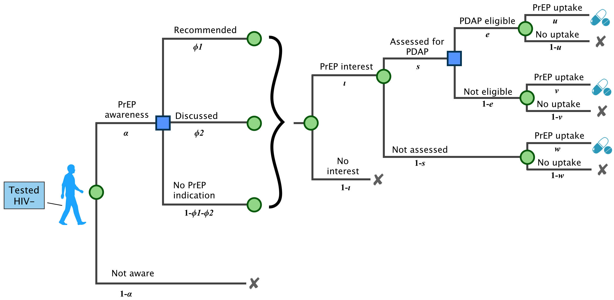

# People Who Do Not Have HIV

##
PrEP-DAP and care continuum

####[Enrollment criteria](https://www.doh.wa.gov/Portals/1/Documents/Pubs/150-082-PayingForPrEPDecisionTree.pdf)
+ Income: no restriction
+ Insurance: cannot receive Medicaid or be eligible for Medicaid
+ Must obtain negative HIV test result within 14 days
+ Prescription: providers are required to certify the prescription
+ In the model, PrEP indication is a modified version of the WA PrEP Implementation Guidelines:
  * *Recommend*: PrEP is recommended for people who meet the following criteria:
      - Diagnosed with gonorrhea in the past 12 months.
      - Ongoing sexual relationships with HIV+ partners who are not virally suppressed or not on ART
  * *Discuss*: Providers should discuss use of PrEP with a person who meets the following criteria:
      - Have unprotected anal sex outside of a mutually monogamous long-term partnership with a man who is HIV-
      - Diagnosed with chlamydia in the past 12 months.
      - Ongoing sexual partnerships with HIV+ partners who are virally suppressed.
  * *No PrEP indication*: does not meet criteria for "Recommend" or "Discuss"
* Assumption: Only individuals who are aware of and interested in PrEP can be enrolled in PrEP-DAP

####Parameters

Note: in the WHPP summary, they split people up first by indication and then by awareness + interest.
That may make more conceptual sense. Also, since R/D/N is evaluated at each time step, we
might want to put that first.

<table>
<tr>
    <th bgcolor="#737CA1"><strong>Label</strong></th>
    <th bgcolor="#737CA1"><strong>Parameter</strong></th>
    <th bgcolor="#737CA1"><strong>Data Source</strong></th>
    <th bgcolor="#737CA1"><strong>Stratification</strong></th>
    <th bgcolor="#737CA1"><strong>Notes/Questions</strong></th>
</tr>

<tr><td colspan=5 bgcolor="#E5E4E2"><i><b>PrEP Awareness, Indication, Interest</i></b></td></tr>

<tr>
    <td><i>a</i></td>
    <td> Percentage of HIV- people who are aware of PrEP </td>
    <td> WHPP </td>
    <td> Race, income, insurance, region </td>
    <td> None </td>
</tr>

<tr>
    <td><i>&phi;1</i></td>
    <td> Percentage of those aware for whom PrEP is recommended </td>
    <td> WHPP </td>
    <td> Race, income, insurance, region </td>
    <td> Based on risk behavior in survey and current WA usage guidelines </td>
</tr>

<tr>
    <td><i>&phi;2</i></td>
    <td> Percentage of those aware for whom PrEP should be discussed </td>
    <td> WHPP </td>
    <td> Race, income, insurance, region </td>
    <td> "" </td>
</tr>

<tr>
    <td><i>t1, t2, t3</i></td>
    <td> Percentage of people with each indication who are interested in taking PrEP </td>
    <td> WHPP </td>
    <td> Race, income, insurance, region </td>
    <td> "" </td>
</tr>

<tr><td colspan=5 bgcolor="#E5E4E2"><i><b>PrEP-DAP</i></b></td></tr>

<tr>
    <td><i>s1, s2, s3</i></td>
    <td> Percentage of interested people with each indication who are assessed for PrEP-DAP </td>
    <td> Expert opinion, calibration </td>
    <td> Race, income, insurance, region </td>
    <td> Will be adjusted to match PrEP-DAP enrollment and assessment numbers</td>
</tr>

<tr>
    <td><i>e1, e2, e3</i></td>
    <td> Percentage of people who are eligible for PrEP-DAP among individuals who are assessed for PrEP-DAP</td>
    <td> Expert opinion, calibration </td>
    <td> Race, income, insurance, region </td>
    <td> "" </td>
</tr>

<tr><td colspan=5 bgcolor="#E5E4E2"><i><b>PrEP uptake</i></b></td></tr>

<tr>
    <td><i>u1, u2, u3</i></td>
    <td> PrEP uptake for people who are eligible for PrEP-DAP </td>
    <td> PrEP-DAP Client Survey </td>
    <td> Race, income, PrEP indication </td>
    <td> None </td>
</tr>

<tr>
    <td><i>v1, v2, v3</i></td>
    <td> PrEP uptake for people who are not eligible for PrEP-DAP </td>
    <td> WHPP </td>
    <td> Race, income, indication </td>
    <td> None </td>
</tr>

<tr>
    <td><i>w1, w2, w3</i></td>
    <td> PrEP uptake for people who are not assessed for PrEP-DAP </td>
    <td> WHPP </td>
    <td> Race, income, indication </td>
    <td> None </td>
</tr>

</table>

####Questions

* Does every enrollee immediately initiate PrEP after PrEP-DAP enrollment enrollment?
* On average, what is the ratio of enrollments to applications for PrEP-DAP in a year?

##
PrEP-DAP recertification

####Recertification criteria
+ **Frequency of recertification**: every year
+ **Test**: must test HIV- in the past 90 days
+ **Proof of taking PrEP**: not required

####Recertification process
+ PrEP-DAP enrollees go through a similar recertification process to ADAP enrollees.
+ However, the reasons of disenrollment (informing <i>p</i>) could be more complicated than disenrollment in ADAP:
    * stopping PrEP
    * no risk factors
    * do not meet the recertification criteria

**Parameters**
<table>
<tr>
    <th bgcolor="#737CA1"><strong>Label</strong></th>
    <th bgcolor="#737CA1"><strong>Parameter</strong></th>
    <th bgcolor="#737CA1"><strong>Data Source</strong></th>
    <th bgcolor="#737CA1"><strong>Stratification</strong></th>
    <th bgcolor="#737CA1"><strong>Question</strong></th>
</tr>

<tr>
    <td><i>p</i></td>
    <td> Probability of disenrollment </td>
    <td> WADOH claims data </td>
    <td> Race, region </td>
    <td> Calculated from average duration of enrollment. </td>
</tr>
</table>

##
Influence of PrEP-DAP on Outcomes

- We assume PrEP-DAP increases PrEP initiation and decreases PrEP stoppage
- This leads to a longer duration of PrEP use among PrEP-DAP clients, on average

## 
PrEP-DAP cost

* Client costs (data source: WADOH claims data)
    - Copays, coinsurance, and/or deductible for:
      - PrEP medication, after Gilead benefits are exhausted
      - Medical and lab visits
      - STI treatment
      - Other relevant healthcare (selective services)
* Assessment cost (data source: expert's opinion)
* Overhead

####Questions
