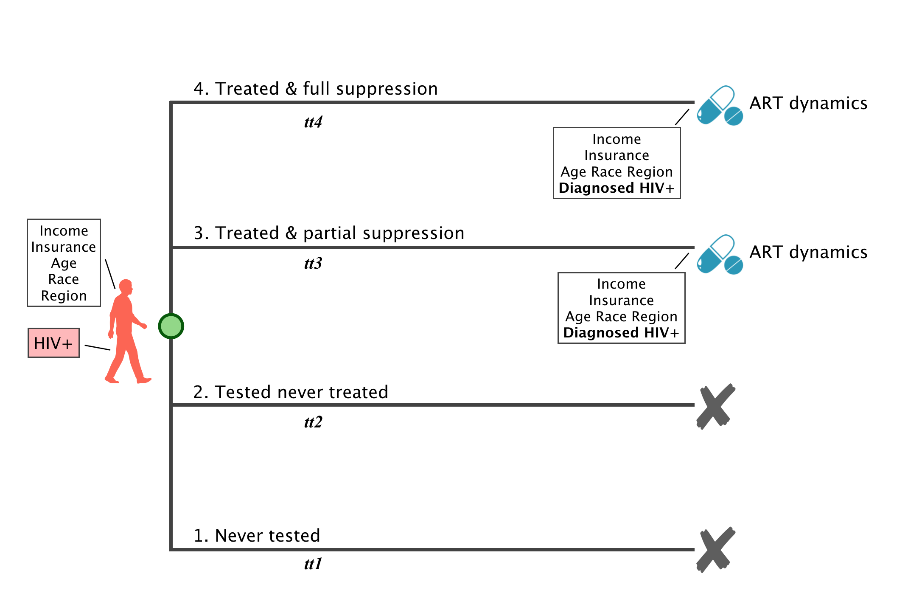
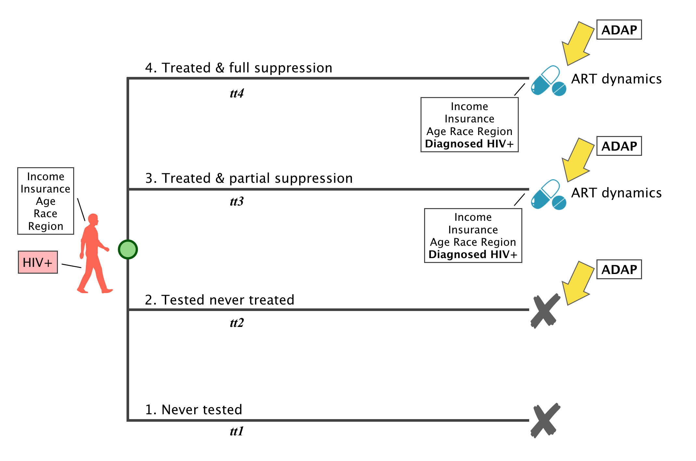
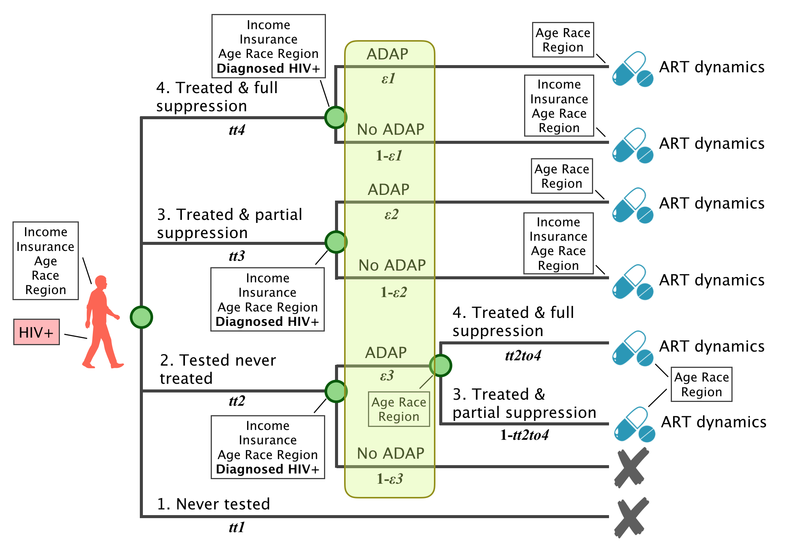
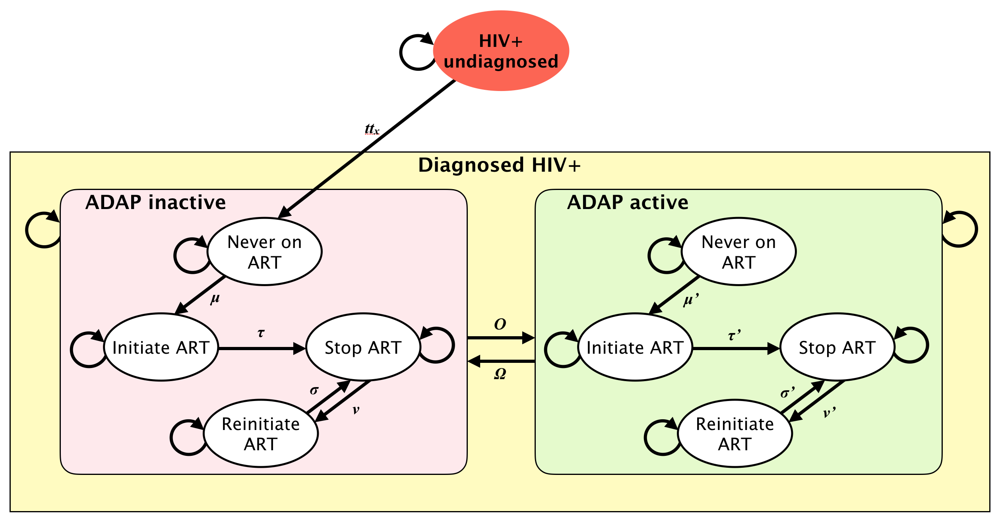

# HIV-positive

##
AIDS drug assistance program (ADAP)

- Originally conceived to pay for HIV treatment (ART) for people living with HIV who couldn't afford it
- Federally funded, but state-administered
- State determines eligibility, enrollment process, and benefits
- Following the passage of the affordable care act in 2010, more people had access to insurance that covered ART (Medicaid expansion; elimination of pre-existing condition clauses)
- Program goal remains the same (support access to ART), but benefits have changed

## Washington State ADAP
- Benefits:
    + Provides assistance in acquiring insurance
    + Pays insurance premiums
    + Pays client-cost of HIV-related medications and healthcare services (deductibles, cost-sharing, co-pays)
    + Pays full cost of ART and HIV-related prescription medications for uninsured
- [Eligibility](http://adap.directory/washington#field_eligibility) depends on the income and insurance status of the individual
    + Income <400% Federal Povery Level
    + Currently uninsired, self-insured, employer-sponsored insurance
    + Not enrolled in Medicaid

##
ART Continuum

**Parameters**
<table>
<tr>
    <th bgcolor="#737CA1"><strong>Label</strong></th>
    <th bgcolor="#737CA1"><strong>Parameter</strong></th>
    <th bgcolor="#737CA1"><strong>Data Source</strong></th>
    <th bgcolor="#737CA1"><strong>Stratification</strong></th>
    <th bgcolor="#737CA1"><strong>Question</strong></th>
</tr>

<tr>
    <td><i>tt1</i></td>
    <td> XX </td>
    <td> XX </td>
    <td> XX </td>
    <td> XX </td>
</tr>

<tr>
    <td><i>tt2</i></td>
    <td> XX </td>
    <td> XX </td>
    <td> XX </td>
    <td> XX </td>
</tr>

<tr>
    <td><i>tt3</i></td>
    <td> XX </td>
    <td> XX </td>
    <td> XX </td>
    <td> XX </td>
</tr>

<tr>
    <td><i>tt4</i></td>
    <td> XX </td>
    <td> XX </td>
    <td> XX </td>
    <td> XX </td>
</tr>
</table>

##
ADAP and care continuum

* Criteria of enrollment
    - Income: 138%-400% of FPL
    - Insurance:
        + Uninsured: find insurance for them
        + Insured: exclude medicaid
    - Prescription: doesn't seem required

* Criteria of recertification
    - Frequency of recertification: every 6 months
    - Testing behavior: NA
    - Behavior of engaging in care: NA

<a href="HIVpositive.md#ARTcontinuum2">Next</a>

<a href="HIVpositive.md#ARTcontinuum3">Next</a>

**Parameters**
<table>
<tr>
    <th bgcolor="#737CA1"><strong>Label</strong></th>
    <th bgcolor="#737CA1"><strong>Parameter</strong></th>
    <th bgcolor="#737CA1"><strong>Data Source</strong></th>
    <th bgcolor="#737CA1"><strong>Stratification</strong></th>
    <th bgcolor="#737CA1"><strong>Question</strong></th>
</tr>

<tr>
    <td><i>&epsilon;1</i></td>
    <td> XX </td>
    <td> XX </td>
    <td> XX </td>
    <td> XX </td>
</tr>

<tr>
    <td><i>&epsilon;2</i></td>
    <td> XX </td>
    <td> XX </td>
    <td> XX </td>
    <td> XX </td>
</tr>

<tr>
    <td><i>&epsilon;3</i></td>
    <td> XX </td>
    <td> XX </td>
    <td> XX </td>
    <td> XX </td>
</tr>

<tr>
    <td><i>tt2to4</i></td>
    <td> XX </td>
    <td> XX </td>
    <td> XX </td>
    <td> XX </td>
</tr>
</table>

##
ART and ADAP dynamics

, where $$tt_x$$ refers to the test/treat trajectory to which an indiviudal was assigned.

**Parameters**
<table>
<tr>
    <th bgcolor="#737CA1"><strong>Label</strong></th>
    <th bgcolor="#737CA1"><strong>Parameter</strong></th>
    <th bgcolor="#737CA1"><strong>Data Source</strong></th>
    <th bgcolor="#737CA1"><strong>Stratification</strong></th>
    <th bgcolor="#737CA1"><strong>Question</strong></th>
</tr>

<tr><td colspan=5 bgcolor="#E5E4E2"><i><b>ADAP dynamics</i></b></td></tr>
<tr>
    <td><i>&Omicron;</i></td>
    <td> Weekly probability of enrolling in ADAP </td>
    <td> Calculated from average time to ADAP enrollment from diagnosis </td>
    <td> Race, income, region, age</td>
    <td> None </td>
</tr>

<tr>
    <td><i>&Omega;</i></td>
    <td> Weekly probability of disenrolling from ADAP</td>
    <td> Calculated from average duration of ADAP enrollment</td>
    <td> Race, region, age</td>
    <td> None </td>
</tr>

<tr><td colspan=5 bgcolor="#E5E4E2"><i><b>ADAP inactive</i></b></td></tr>

<tr>
    <td><i>&mu;, &mu;'</i></td>
    <td> Weekly probability of ART initiation after diagnosis (tx naive)</td>
    <td> Previous publications, eHARS, WADOH claims data (?) </td>
    <td> Treatment trajectory, ADAP status, race, region </td>
    <td> None </td>
</tr>

<tr>
    <td><i>&tau;, &tau;</i></td>
    <td> Weekly probability of ART discontinuation </td>
    <td> Previous publications, eHARS, WADOH claims data (?) </td>
    <td> Treatment trajectory, ADAP status, race, region </td>
    <td> None </td>
</tr>

<tr>
    <td><i>&nu;, &nu;'</i></td>
    <td> Weekly probability of reinitiating ART after discontinuation </td>
    <td> Previous publications, eHARS, WADOH claims data (?) </td>
    <td> Treatment trajectory, ADAP status, race, region </td>
    <td> None </td>
</tr>

<tr>
    <td><i>&sigma;, &sigma;'</i></td>
    <td> Weekly probability of discontinuing ART after reinitiation </td>
    <td> Previous publications, eHARS, WADOH claims data (?) </td>
    <td> Treatment trajectory, ADAP status, race, region </td>
    <td> None </td>
</tr>

</table>

## 
ADAP cost

* Client costs
    - Insurance premium (+)
    - ART out of pocket costs coverage (+)
    - Healthcare out of pocket cost coverage (select services) (+)
* Assessment cost
