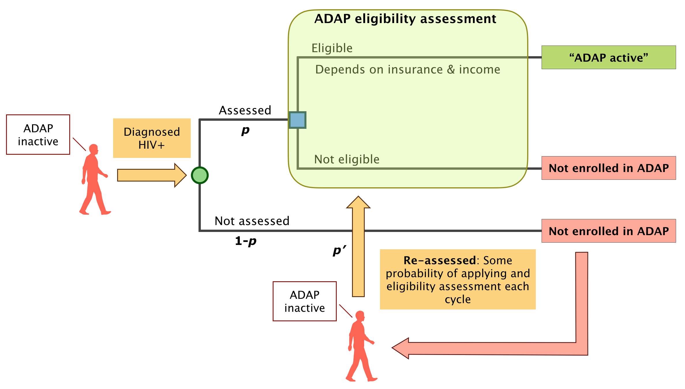
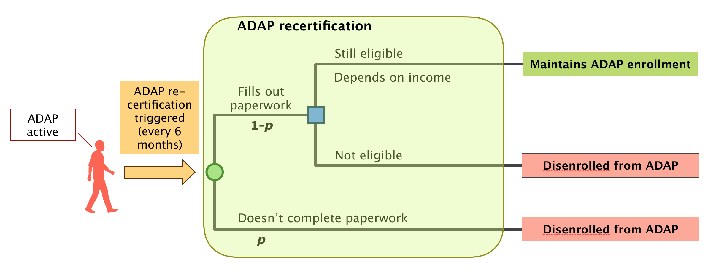

# People Living With HIV/AIDS

##
ADAP enrollment

####[Enrollment criteria](http://adap.directory/washington#field_eligibility)
+ Income: must be below 400% of the federal poverty level (FPL), and must not be eligible for Medicaid (i.e., above 138% FPL)
+ Insurance status prior to entering ADAP:
    * Cannot have Medicaid or be eligible for Medicaid
    * Can be uninsured: ADAP will purchase insurance

####Parameters

<table>
<tr>
    <th bgcolor="#737CA1"><strong>Label</strong></th>
    <th bgcolor="#737CA1"><strong>Parameter</strong></th>
    <th bgcolor="#737CA1"><strong>Data Source</strong></th>
    <th bgcolor="#737CA1"><strong>Stratification</strong></th>
    <th bgcolor="#737CA1"><strong>Question</strong></th>
</tr>

<tr>
    <td><i> p </i></td>
    <td> Probability of assessment for ADAP eligibility upon diagnosed HIV+ </td>
    <td> XX </td>
    <td> XX </td>
    <td> XX </td>
</tr>

<tr>
    <td><i> p' </i></td>
    <td> Probability of reassessment for ADAP eligibility every cycle </td>
    <td> XX </td>
    <td> XX </td>
    <td> XX </td>
</tr>
</table>

####Questions
* What is the proportion of the applicants who are eligible for ADAP every year? 
* Do most of the ADAP enrollees immediately initiate ART after enrollment?
* Are there records of diagnosed date prior to ADAP enrollment?

##
ADAP recertification

####Recertification criteria
- Clients must recertify every 6 months.
- It seems that the reapplication does not depend on treatment adherence or behavior. 

####Parameters
<table>
<tr>
    <th bgcolor="#737CA1"><strong>Label</strong></th>
    <th bgcolor="#737CA1"><strong>Parameter</strong></th>
    <th bgcolor="#737CA1"><strong>Data Source</strong></th>
    <th bgcolor="#737CA1"><strong>Stratification</strong></th>
    <th bgcolor="#737CA1"><strong>Question</strong></th>
</tr>

<tr>
    <td><i> p </i></td>
    <td> Weekly probability of disenrolling from ADAP </td>
    <td> XX </td>
    <td> XX </td>
    <td> </td>
</tr>
</table>

####Questions

* Is engaging in care a requirement for recertification?
* How often ADAP enrollees are disenrolled because of changes in income and insurance, or because of other reasons? 

## 
ADAP influences outcomes

* ADAP status might increase ART initiation and reinitiation, and decrease ART stoppage.
* ADAP status might affect the individuals' test/treat trajectories. 
    - Individuals who were originally assigned to trajectory 2 (tested but never treated) could be engaged in care because of enrolling in ADAP. 
        + These individuals are reassigned to trajectory 3 (treated & partial suppression) or trajectory 4 (treated & full suppression)
        + This has been implemented in the development of the CEA component for WHAMP in EpiModelHIV.
        + Data:  (note) please fill out the potential data source here 
    - ADAP active individuals who were originally assigned to trajectory 3 (treated & partial suppression) could switch to trajectory 4 (treated & full suppression). 
        + This might be because of higher adherence to the treatment.
        + This is not implemented yet but is in discussion in our group. 
        + Data:  (note) please fill out the potential data source here if there is 

## 
ADAP cost

* Client costs
    - Insurance premium (if insurance is ADAP-sponsored)
    - Copay, coinsurance, deductible for:
      - ART
      - HIV-related medical services
      - Other medical services
* Assessment cost
* Overhead

####Questions

* On average, what is the ratio of enrollments to applications for ADAP in a year?
