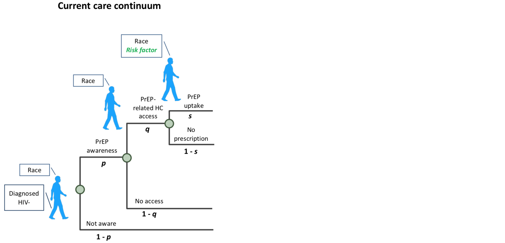
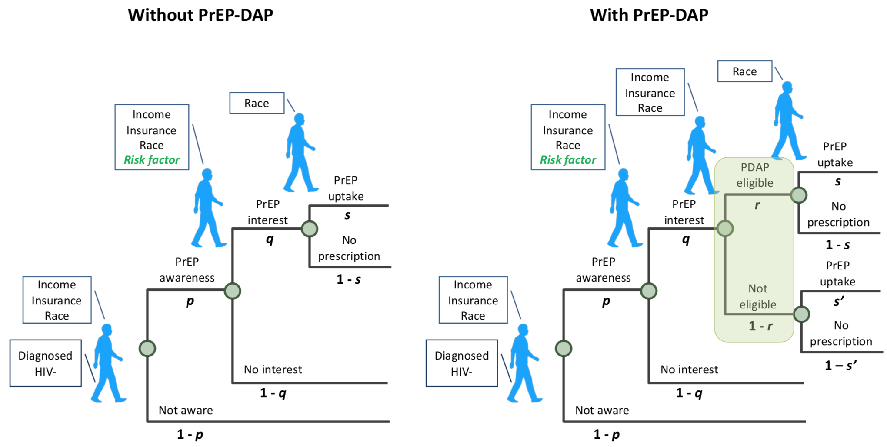

# PrEP care continuum

**Adding PrEP-DAP**

* PrEP awareness and uptake could depend on income, insurance, and risk factors. 
* The code doesn't take PrEP interest into consideration currently. 
* Do people who take PrEP ~= PDAP enrollees? 
* How to incorporate PrEP interest and PDAP eligibility to the current care continuum structure? 

<a href="ModuleSum.html#PrEP">Back</a>

